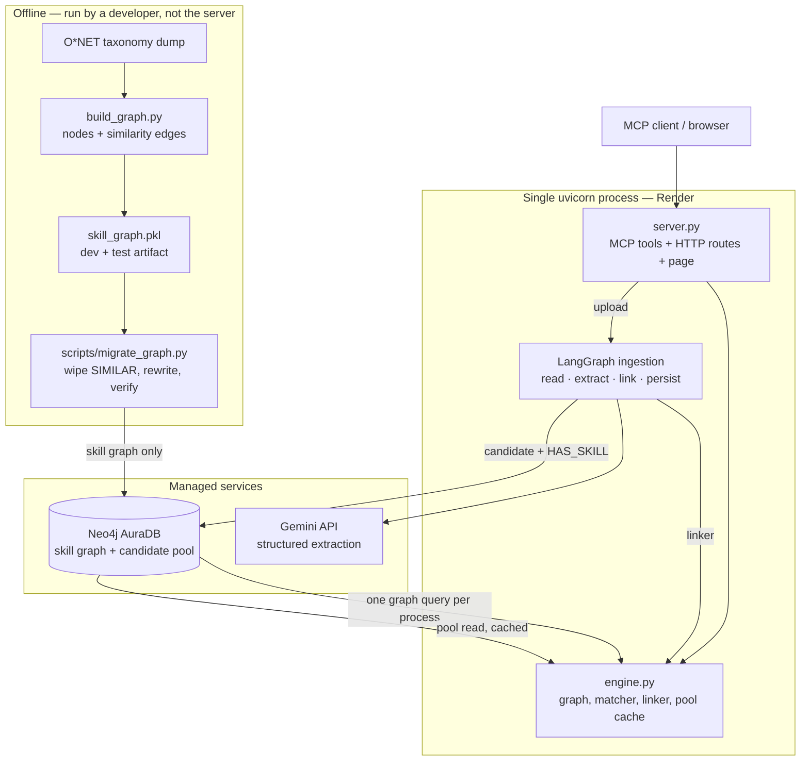

# Synapse — Technical Architecture

A detailed description of what Synapse is, how it is built, how data moves through
it, and why each engineering decision was made the way it was.

This document deliberately contains no evaluation results. It describes the
*solution*, not its scores. Where an experiment is discussed, the interest is in
what the experiment was designed to isolate and what it changed about the design —
the measurements themselves live in `src/synapse/eval/RESULTS.md` and the study
documents under `data/eval/`.

---

## 1. What the system does

Synapse ranks candidates against a job description.

The ordinary way to do this is lexical or semantic overlap: count shared keywords,
or embed both documents and take a cosine similarity. Both approaches treat a
skill as an opaque token. Under them, a candidate who has never touched anything
in the job's domain and a candidate who is one short step away from every
requirement look equally unqualified, because in both cases the literal overlap is
zero.

That distinction is the entire point of the product. A hiring manager does not
think "this person lacks Kubernetes." They think "this person runs Docker in
production, so Kubernetes is a week away," and they think something quite different
about a candidate whose background has no adjacency to containers at all.

Synapse encodes that judgement structurally. Skills are nodes in a graph, and
relatedness is an edge. A requirement the candidate does not hold is then not a
single undifferentiated "gap" — it is either **bridgeable**, meaning a short
weighted path connects it to something they do hold, or **unreachable**, meaning no
such path exists within the configured radius.

Every score the system emits is decomposed into the terms that produced it, and
every bridge is returned with the path that justified it. A caller can always ask
"why this number" and get a structural answer rather than a similarity score.

---

## 2. The central idea

For one candidate against one job description, the scoring function partitions the
job's required skills into three sets:

| Partition | Meaning | Contribution |
|---|---|---|
| **Matched** | The candidate holds the skill outright | Positive credit, scaled by proficiency |
| **Bridged** | Missing, but within the bridging radius of a held skill | Partial credit, scaled by path distance |
| **Unreachable** | Missing, with no qualifying path | No credit; optionally a penalty |

The total is the sum of those contributions normalised by total demand. Because
each term is tracked separately, the result object carries the full derivation
rather than a single opaque float.

Two properties follow from this design and constrain everything downstream:

1. **The graph is the substrate for the middle category.** Without an edge
   structure there is no "bridged" — the partition collapses to matched/missing,
   which is what an overlap baseline already does.
2. **Canonicalization is a precondition, not a detail.** "K8s", "k8s" and
   "Kubernetes" must be the same node before any of this means anything. If they
   are three nodes, adjacency is meaningless and the partition is noise.

---

## 3. System topology



The important structural facts:

- **One process serves everything.** The MCP transport, the JSON API, the upload
  path and the static page are mounted on the same ASGI app. There is no second
  service, no worker, no build step and no cross-origin configuration.
- **The graph is built offline.** Constructing it requires the full O*NET dump and
  an embedding pass over every skill. Doing that at boot would drag heavy
  dependencies into the serving path and make cold starts unbounded.
- **AuraDB is the system of record** for both halves of the data: the skill graph
  and the candidate pool. The pickle is a development and test artifact, not a
  production fallback.
- **The two halves are written by different paths.** Migration writes the skill
  graph and never touches candidates; ingestion writes candidates and never
  touches the skill graph. Neither can corrupt the other's data.
- **Only two external services are on the critical path**: AuraDB for the graph, and
  Gemini for extraction. Extraction is an ingestion-time concern, not a query-time
  one, so a ranking query never depends on the LLM.

---

## 4. The pipeline, stage by stage

### 4.1 Reading — `src/synapse/ingest/reader.py`, `resume.py`

Loads `.txt`, `.md`, `.docx` and `.pdf`, normalises whitespace, and splits into
overlapping word windows. There are two entry points over the same machinery:
`read_document` for a path on disk, and `read_bytes` for an uploaded buffer, which
is what an HTTP upload has — a filename and a body, never a path. Both produce the
same `Document`, so everything downstream is indifferent to how the bytes arrived.

**Binary parsing lives in one module.** `resume.py` owns `pdf_text` and
`docx_text`, and the reader calls them. These previously existed twice, and the
copies had drifted: one read `.docx` tables and the other did not, so the same
résumé yielded different text depending on which path opened it. Parser failures
from either library are normalised to `ValueError`, so a corrupt upload is a
client error at the route rather than a vendor exception escaping the pipeline.

Three decisions here are load-bearing:

**Line structure is preserved.** `normalize_text` collapses intra-line whitespace
and runs of blank lines, but keeps line breaks. In a résumé, line breaks separate
bullets, and each bullet is usually one claim. Flattening the document into a
single paragraph destroys the boundary that tells the extractor where one skill
claim ends and the next begins.

**Chunks overlap.** Windows are ~375 words with ~40 words of overlap. The overlap
exists so that a skill named near a chunk boundary is not severed from the sentence
that evidences it — the extractor is asked to justify each skill with a span of
source text, and a skill whose justification fell in the previous chunk cannot be
justified.

**`.docx` tables are read explicitly.** Résumés frequently place the entire skills
section inside a table, and the default paragraph iteration of `python-docx` skips
table content entirely. Reading paragraphs alone would silently miss the single most
important section of a large fraction of real documents.

`python-docx` and the PDF library are imported lazily, inside their own branches, so
the rest of the pipeline stays importable without either.

### 4.2 Extraction — `src/synapse/ingest/extractor.py`

Sends each chunk to Gemini with a strict response schema and gets back
`[{skill, weight, context}]`.

**The model's output is re-validated in our own code.** The SDK will happily parse
the response into the declared schema, but that parse is a convenience, not a
correctness guarantee. Every response is re-validated against our own Pydantic
models, and the *raw text* is parsed rather than trusting `response.parsed`. A
schema violation — a weight outside the permitted band, an empty skill string — is
caught by our contract, not the vendor's.

**Malformed output is retried, then recorded as failed — never coerced.** A chunk
that will not produce schema-valid output after its retries is written into
`failed_chunks` on the result. This matters more than it sounds: the alternative is
a silent partial extraction that looks complete, which then propagates into scoring
as an apparently confident but under-informed profile.

**Fenced JSON is tolerated.** Models intermittently wrap output in a markdown code
fence despite an explicit JSON mime type, so the payload is stripped of fences
before parsing.

**Rate limiting is client-side and explicit.** A sliding-window limiter enforces an
RPM ceiling before each call, and failures back off exponentially with jitter. The
free tier's limit is low enough that an unthrottled batch run turns into a wall of
429s; the limiter converts that failure mode into slowness, which is recoverable.

`extract_once` performs exactly one attempt with no internal retry loop. That
exists so the LangGraph pipeline can own the retry policy itself rather than
inheriting a hidden one — see §4.6.

### 4.3 Canonicalization — `src/synapse/matching/entity_linker.py`

Maps free-text skill phrases onto canonical graph nodes through a deterministic
cascade, most reliable layer first:

```
1. alias table    hand-maintained overrides ("k8s" -> "Kubernetes")
2. surface index  exact match, vendor-stripped forms, embedded acronyms
3. embedding      cosine similarity, accepted only above a threshold
4. unresolved     logged, never force-linked
```

**The cascade is ordered by determinism, not by power.** The embedding layer is the
most capable and the least predictable, so it runs last and only on surfaces the
deterministic layers could not resolve. A hand-written alias is never overridden by
a model's opinion.

**Below-threshold matches are refused, not force-linked.** This is the single most
important decision in the module. A forced link is invisible: the pipeline continues,
a score is produced, and nothing indicates that a skill was attached to the wrong
node. An explicit `unresolved` is loud — it appears in the response, it is excluded
from the demand denominator, and it can be inspected. Silent bad linking is worse
than an acknowledged failure.

**Unresolved surfaces are logged for ontology expansion but never auto-merged.**
Adding nodes to the shared graph on the basis of arbitrary input is a write to a
shared resource driven by unvalidated data; it is deferred to an explicit,
deduplicated path (§4.8).

**The embedder is injected, not constructed internally.** This is what allowed the
dev-phase embedder to be swapped for the production ONNX one as a constructor
argument, and it is what lets the tests run with a stub and no model download.

**Node embeddings are context-enriched.** A node is embedded as its name plus its
category rather than the bare name, which disambiguates short and overloaded skill
strings. The same enrichment is applied when the graph is built, so the two agree.

### 4.4 The graph substrate — `src/synapse/graph/build_graph.py`

Nodes are skills drawn from the O*NET taxonomy; roles are also present and linked
to their required skills, though roles play no part in scoring.

Similarity edges are produced by two passes over the embedding cosine matrix,
unioned:

1. **Rank-based** — the top *k* neighbours of each skill, floored at a minimum
   similarity.
2. **Threshold-based** — every pair at or above a stronger similarity, regardless
   of rank.

The second pass exists because a fixed top-*k* budget is consumed inside dense
clusters, so genuine high-similarity pairs sitting at rank *k+1* would be dropped.
The union is scored by the higher of the two.

Edge weight is similarity; the matcher converts to distance as `1 − weight`. Keeping
the stored value as similarity and deriving distance at use makes the graph readable
(a higher number means more related) while giving the traversal the additive cost it
needs.

### 4.5 Scoring — `src/synapse/matching/matcher.py`

The matcher is the algorithmic core, and it is pure: it takes a graph, a JD skill
map, a candidate skill map and a parameter object, and returns a result. It performs
no I/O and holds no state beyond the graph view it builds at construction.

**A skill-only view is built once.** At construction the matcher extracts the
skill nodes and similarity edges into a separate graph. Role nodes and `requires`
edges are excluded, so a traversal cannot accidentally route through a job title.
Skills with no similarity edge are seeded explicitly as isolated nodes rather than
being absent, so "why did this not bridge?" is answerable — an absent node and an
unconnected node are different diagnoses.

**One multi-source Dijkstra per candidate.** Reachability is computed from the
candidate's entire held set at once, rather than running a shortest-path query per
(missing skill × held skill) pair. This is both faster and semantically correct: what
matters is the distance to the *nearest* held skill.

**Distance and hops are computed separately.** Two Dijkstra passes run — one weighted
by distance, one with unit weights. The cheapest weighted path is not always the
shortest in hops, and the two answer different questions. Collapsing them would make
the hop-radius parameter meaningless.

**The traversal bound and the scoring threshold are different parameters.**
`search_cutoff` bounds how far the traversal walks and is a performance knob;
`bridge_cutoff` decides what counts as bridgeable and is a scoring decision. Folding
them together previously allowed a pruned node to be reported as simultaneously one
hop away and infinitely far — a contradiction that only disappears when the two
concerns are separated.

**Every gap carries a reason code.** A skill that did not bridge reports *why*:
`no_path`, `beyond_distance(...)`, `beyond_hops(...)` or `bridging_disabled`. This
turns "missing" from an assertion into evidence, and it is what makes the difference
between a graph problem and a linking problem diagnosable from a response alone.

**All tunables live in one frozen dataclass.** `ScoringParams` holds every constant —
bridging radius, credit scale, penalties, proficiency reference. No magic numbers are
inlined in the scoring function. The ablation study varies instances of this object
rather than editing the module, which is what makes the arms comparable.

**Bridge credit is capped relative to a direct match.** A separate ceiling parameter
bounds what one bridged skill may earn. Without it, a sufficiently large credit
multiplier lets a near-miss out-earn actually holding the skill, and the ranking
inverts: a candidate holding none of a role's requirements can outrank one holding
all of them. The ceiling defaults to *no cap* — because a numeric default is inert
only at low credit scales, and silently rewrites results at the scales the evaluation
actually selected. Serving sets a real ceiling explicitly; evaluation leaves it off
unless it is being swept.

**The result object is the explanation.** `MatchResult` exposes the total alongside
`direct_match_score`, `bridge_score`, `gap_penalty`, `total_demand`, the matched
skill list, and the bridged and unreachable gaps with their paths. The structure is
what makes downstream explanation possible without recomputation.

### 4.6 Ingestion orchestration — `src/synapse/ingest/pipeline.py`

Reader, extractor, linker and candidate store are wired into a LangGraph graph over
an explicit typed state.

```
read ──▶ extract ──group ok, more left──▶ extract
           │  │
           │  └──all chunks done──▶ link ──▶ persist ──▶ finalize ──▶ END
           ▼                         │         │
        backoff ──retries left──▶ extract      │
           │                                   ▼
           └──gave up──▶ extract / link / persist / finalize
```

**One graph, two shapes.** The linker and the store are optional collaborators. Without
them the graph is exactly the Phase C3 pipeline — read, extract, write JSON — and the
`link` and `persist` nodes are pass-throughs the routers skip. With them it is the
Phase E pool ingestion that ends in AuraDB. Both nodes always *exist*, so the routing
table has one shape rather than two, which is what avoids a second, drifting copy of
the retry and checkpoint logic.

**Collaborators are closed over, not carried in state.** A live SDK client, an ONNX
embedder and a database driver are none of them serializable, and putting them in
state would break checkpointing outright.

**Retry is a node, not a `try/except`.** A rate-limit or transport failure is a
routing decision the graph makes and records in state. The consequence is that "why
did this document take four minutes" is answerable after the fact from the
checkpoint, rather than being buried in a log line inside a helper. Fatal errors —
bad credentials, exhausted quota — are classified separately and skip retrying
entirely rather than burning the full budget on a request that cannot succeed.

**One backoff node serves both failing stages.** Extraction and persistence fail for
the same reasons — a rate limit, a dropped connection — so they route to the same
node, which reads `stage` from state to know where to return. Their fatal
classifications differ, because an exhausted LLM quota and a Neo4j auth error are
not the same condition, but the waiting is identical and is written once.

**Linking failure is terminal, persistence failure is not.** A broken or absent
embedder will not fix itself on retry, so `link` fails the document immediately —
but *without* discarding the extraction, which still reaches `finalize` and the
caller. A failed write is different: it is retried, and if it is given up on, the
document ends `persist_failed` with the extraction still returned and the checkpoint
positioned so a re-run resumes at the write rather than re-billing Gemini.

**Extraction advances one chunk group per superstep.** This is what gives the
checkpointer something to persist between LLM calls. Batching a whole document into a
single node would make its checkpoint all-or-nothing, which defeats the purpose. The
group size is configurable (`chunks_per_call`): a résumé is small enough that sending
its chunks one at a time spends more of the free tier's request budget than it needs
to, so several chunks can share a call while the checkpoint still advances per call.
The trade is granularity against request count, and it is a parameter rather than a
decision baked into the node.

**Checkpointing is SQLite-backed.** A run killed during a rate-limit pause resumes at
the chunk it stopped on rather than re-billing the whole document against the free
tier. The runner inspects the saved state and resumes pending work instead of
restarting.

**Each document gets its own checkpoint thread, keyed by a digest of its full path.**
The stem alone is not enough: two files can share a stem and differ by extension, and
sharing a thread would let one document resume the other's pending work. For uploads
the path is not the identity — the same résumé arrives under whatever name the
browser gave it — so the upload route keys the thread on the document's content hash
instead, which is the same identity the pool already deduplicates on.

### 4.7 The candidate pool — `neo4j_client.py`

An ingested résumé becomes a `Candidate` node with a `HAS_SKILL` edge to each
canonical skill it resolved to, carrying the weight, the justifying context span,
and the link method and score that produced it.

**Skills are stored as edges to existing nodes, not as new nodes.** A candidate can
only ever point at the shared taxonomy, so ingesting a résumé cannot widen the
ontology. That is what keeps the skill graph's shape assertion meaningful while the
pool grows without bound.

**Re-ingesting a candidate replaces its edges rather than adding to them.** The write
deletes the existing `HAS_SKILL` set before writing the new one, so a re-run after a
better extraction leaves one profile, not a union of two. The node itself is merged,
so its identity and history survive.

**The content hash is indexed, and a hit means no second extraction.** A document
already extracted is recognised before any call to Gemini. Extraction is the
expensive, rate-limited step and a résumé's skills do not change between uploads, so
re-uploading the same file is a lookup, not a bill.

**Provenance travels with the profile.** The model, prompt version, chunk count,
failed chunks and unresolved surfaces are stored on the node. A score derived from a
partial extraction is therefore identifiable as one after the fact, which is the
difference between an under-informed profile and an apparently confident one.

### 4.8 The graph in production — `neo4j_client.py`, `neo4j_loader.py`

The AuraDB client holds parameterized Cypher for node lookup, vector similarity
search, bounded shortest-path queries, and the deduplicated dynamic MERGE. The
loader materialises the remote graph into NetworkX.

**Queries are parameterized, never interpolated.** The two exceptions are values
Cypher cannot parameterize — a variable-length hop bound and a vector index
dimension — and both are validated as integers before use.

**Traversal is always bounded.** An unbounded variable-length match on a densely
connected graph enumerates a combinatorial number of paths and does not return. A
`None` hop limit means "use the default", not "unbounded", and a hard ceiling caps
it regardless.

**Connection timeouts are bounded and explicit.** A network that *drops* packets to
the Bolt port rather than refusing them will otherwise leave the driver hanging for
its full default timeout, which turns any fast failure path into a stall.

**Configuration is read at instantiation, not import.** Reading environment variables
as dataclass field defaults evaluates them once, at class-definition time, so any
caller that loads a `.env` file after importing the module silently gets localhost
and an empty password — and the resulting failure looks like a network problem
rather than a configuration one.

**Dynamic MERGE is deduplicated first.** Before writing an unknown skill, the client
vector-searches existing nodes and only creates a new one if nothing sufficiently
similar exists. This is the guard that stops "JS", "JavaScript" and "Javascript"
becoming three nodes. It is exposed as an explicit engine method and is deliberately
*not* wired into the request path — see §7.

**Re-migration deletes similarity edges before rewriting them.** The migration is
built out of `MERGE`, which is the right primitive for making a write idempotent but
the wrong one for replacing a set: merging a rebuilt edge list onto an existing graph
produces the *union* of old and new pairs, not the new ones. So a rebuilt graph is
migrated by wiping `SIMILAR` first and then writing. The wipe is scoped to that
relationship type — `Candidate` and `HAS_SKILL` are never touched, because the pool
is independent data that a graph rebuild has no business destroying — and the script
offers a dry run and verifies the resulting shape against the source artifact before
reporting success.

---

## 5. How the design was validated

The project's governing rule was that no infrastructure would be built until an
evaluation said the graph-reasoning approach was worth productionizing. The
experiments below are described for their design; their outputs are recorded
elsewhere.

### 5.1 The dataset

Job descriptions are drawn from real role profiles. Candidate skill sets are
generated synthetically with *controlled* overlap, which is the key property: because
each candidate is constructed to sit in a known tier relative to its JD — strong,
bridgeable, weak, irrelevant — the correct ranking is known by construction rather
than by annotation.

The tiers are built so that the bridgeable tier has *less* literal overlap with the
JD than the weak tier. That is deliberate and adversarial: any scorer that ranks by
bag-of-skills overlap must get the bridgeable-vs-weak comparison wrong. The benchmark
is designed so that the thing being claimed is the thing being measured.

The snapshot is versioned and immutable. A changed dataset gets a new version
directory rather than mutating the existing one, so numbers stay comparable across
time. A held-out split is reserved and not consulted while tuning.

### 5.2 Baselines

Two, both deliberately cheap:

- **TF-IDF over raw text** — no graph, no LLM. The floor.
- **Embedding cosine over full documents** — the same embedding model, no graph
  reasoning, no gap logic. This is the honest competitor: it isolates exactly what
  the graph is supposed to add over "embeddings, done well".

A third internal control, **bridging disabled**, runs the full Synapse pipeline with
the graph traversal switched off. Comparing against it separates "the graph helps"
from "LLM extraction and canonicalization help".

### 5.3 Metrics

Standard ranking metrics (nDCG, precision at K, MRR) plus a bespoke pairwise
accuracy on the bridgeable-versus-weak comparison — the specific decision the graph
exists to get right — and a precision measure on the bridgeable label itself.

Confidence intervals are bootstrapped by resampling **job descriptions**, not
candidate pairs. Pairs within a JD are not independent — they share a JD, a skill
set and a construction seed — so resampling pairs would produce intervals that are
far too narrow. The resampling seed is fixed and shared across rankers so that
intervals are paired and differences are attributable to the rankers rather than to
the resampling.

### 5.4 Ablations

Each varies one factor from the selected configuration: proficiency weights on
versus uniform, bridging on versus off, and the bridging radius at one hop versus
two. The point is not to find the best configuration but to show which components
earn their place.

### 5.5 The edge-substrate study

The similarity graph is built from embedding cosine, which is one choice among
several. The study compared it against a categorical control (edges derived purely
from taxonomy category membership, no embedder) and against LLM-classified typed
edges, where an LLM labels each pair as substitute, complement, prerequisite or
unrelated, and only some types are traversable.

The categorical arm is the important control: it tests whether the embedder
contributes anything beyond the taxonomy structure it was applied to. Without it, a
result attributed to embeddings might just be a result about O*NET's categories.

### 5.6 The density audit

A structural audit of the produced graph rather than of its scores: edge count
against the maximum possible, whether relationships are stored once or in both
directions, the distribution of edge weights, the hop distribution over all skill
pairs, and the proportion of missing skills that classify as bridgeable over random
draws.

This was prompted by a simple question — is "bridgeable" actually discriminating
anything, or is it labelling everything? — and it is the kind of check that score
metrics cannot answer, because a classifier that says "yes" to everything can still
score well on a benchmark where the answer is often yes.

It also settled a concrete build-time question: whether the similarity threshold used
to admit edges is meaningfully selective given the distribution of pairwise cosines
the embedder actually produces on short skill strings.

### 5.7 The count-only control

The most important experiment for the architecture, because it tests the premise
rather than the implementation.

If bridge credit is close to constant per bridge, then the bridge term reduces to a
constant times the *number* of unmet skills, and the graph's path structure
contributes nothing that counting could not. The control implements exactly that: it
reuses the direct-match term unchanged, replaces the bridge term with a flat credit
per unmet skill, and performs no traversal at all. The no-traversal property is
asserted in tests by replacing the traversal entry points with tripwires that fail
the test if they are reached.

Designing this control surfaced a subtlety worth recording: the constant matters
enormously. A per-gap credit below the value of holding a skill produces a scorer
that is monotone in direct-match and therefore ranks identically to direct-match-only;
a credit exactly equal to it makes every candidate tie; only above it does the term
begin rewarding gaps. Comparing against the wrong constant answers the wrong
question, so the control is run at a constant matched to the graph scorer's own
average bridge credit.

### 5.8 Reproducibility practices

Fixed seeds, a versioned and immutable dataset snapshot, pinned dependency versions,
deterministic tie-breaking in every ranker (ties break on name, so a ranking is
reproducible), and evaluation arms that are frozen — a change that moves an existing
arm's number is treated as a defect to investigate, not a new result.

Two lessons were learned the hard way and are now enforced structurally: a parameter
added with a "harmless" default can silently rewrite published numbers if the default
is inert only under some configurations, and a graph artifact rebuilt after results
were generated makes those results unreproducible even though nothing in the code
changed.

---

## 6. Cloud architecture and data movement

There are two distinct flows. They meet at the candidate pool and the skill graph,
and share nothing else — in particular, no code path is common to both, so the
expensive, rate-limited half cannot affect the latency of the cheap one.

### 6.1 Ingestion flow (one document, write path)

```mermaid
sequenceDiagram
    participant IN as Upload / directory
    participant R as read node
    participant X as extract node
    participant B as backoff node
    participant G as Gemini API
    participant CK as SQLite checkpoint
    participant L as link node
    participant P as persist node
    participant A as AuraDB

    IN->>R: bytes + filename, or a path
    R->>R: parse (pdf / docx / txt / md), normalise
    R->>R: chunk with overlap, hash the text
    opt upload path
        R->>A: does a candidate already hold this hash?
        A-->>R: hit — reuse the profile, skip extraction entirely
    end
    loop one chunk group per superstep
        X->>G: chunk group + response schema
        alt schema-valid response
            G-->>X: JSON skills
            X->>X: re-validate with Pydantic
            X->>CK: persist cursor + partial skills
        else rate limit / transport failure
            G-->>X: error
            X->>B: stage = extract, attempt + 1
            B->>B: wait; fatal errors skip retrying
            B->>X: resume this group, or record it failed
        end
    end
    X->>L: merged ExtractedSkill set
    L->>L: alias, surface, embedding cascade
    L->>P: canonical nodes + weights + context
    P->>A: MERGE Candidate, replace HAS_SKILL edges
    alt write fails
        A-->>P: error
        P->>B: stage = persist
        B->>P: retry, or finish persist_failed
    end
    P-->>IN: profile, unresolved surfaces, failed chunks
```

This flow writes `Candidate` nodes and `HAS_SKILL` edges and nothing else. It never
adds a `Skill` node: a surface the linker cannot resolve is reported as unresolved,
not invented. New skills reach the taxonomy only through the explicit, deduplicated
MERGE path, which no request path calls.

### 6.2 Query flow (online, read-only)

```mermaid
sequenceDiagram
    participant C as MCP client / browser
    participant S as server.py
    participant E as engine.py
    participant A as AuraDB
    participant M as Matcher

    C->>S: rank_candidates(jd_skills) — pool, or an explicit list
    S->>E: delegate, unchanged arguments
    E->>E: graph loaded?
    alt first request of the process
        E->>A: one query for nodes + edges
        A-->>E: skills, similarity pairs, roles
        E->>E: build NetworkX, assert shape
    end
    alt no candidates given
        E->>E: pool cached?
        E->>A: load candidate pool
        A-->>E: candidates + HAS_SKILL weights
        E->>E: cache; names are already canonical
    else candidates given
        E->>E: resolve surfaces through the linking cascade
    end
    E->>E: resolve JD surfaces; keep the unresolved ones
    E->>E: overlay per-request overrides on the tuned params
    E->>M: rank(jd_map, candidates, params)
    M->>M: multi-source Dijkstra per candidate
    M-->>E: MatchResult per candidate
    E->>E: adapt — sentinel for unreachable, attach unresolved
    E-->>S: typed response with components and candidate_source
    S-->>C: JSON
```

**A query never calls Gemini and never writes.** The LLM is an ingestion-time
dependency only. This keeps query latency bounded by graph traversal and keeps the
serving path independent of a rate-limited external API.

**The pool is the default input, an explicit list the exception.** Extraction is
expensive and a résumé's skills do not change between searches, so the normal path
scores candidates that were ingested once and are re-read from the pool. The
response says which of the two produced it (`candidate_source`), because a ranking
over an empty pool and a ranking over a supplied list are otherwise indistinguishable
from the outside.

**Pool skills bypass the linker.** They were canonicalized at ingestion time and are
stored as node names, so re-linking them would let a change in the linker silently
move the scores of candidates nobody re-ingested.

**The skill graph is read from AuraDB once per process lifetime**, not once per
request. It is small enough that materialising it is cheaper than querying it per
traversal, and this keeps the scoring code identical to the code the evaluation
measured. The candidate pool is read on the same terms — once, then cached — but
invalidated when an ingestion writes, because the pool is the half of the data that
actually changes while the process runs.

### 6.3 Why the graph is materialised rather than queried

This is the most consequential cloud-architecture decision in the system, so the
reasoning is spelled out.

The alternative is to push traversal into Cypher and let AuraDB compute shortest
paths. Against that:

- **It would change the code that produces the numbers.** The deployment requirement
  is that production reproduces the evaluation. Replacing an in-process Dijkstra with
  a Cypher traversal means every result must be re-validated against a second
  implementation of the same algorithm.
- **It buys almost no memory.** The graph is on the order of a megabyte. What
  actually threatens the memory budget is the ONNX embedding runtime, which stays
  resident regardless of where traversal happens.
- **It adds a network round trip per traversal.** Scoring a pool of candidates
  performs one traversal per candidate; each becoming a remote query is a large
  latency multiplier for no gain.

The trade accepted in exchange is staleness: a node written to AuraDB after startup
is invisible until the graph is reloaded. That is handled explicitly by invalidating
the cached graph whenever a write creates a node.

### 6.4 There is no automatic fallback

An earlier design considered falling back to a local graph when AuraDB is
unreachable. It was rejected.

The failure mode of a silent fallback is not downtime — it is a service that reports
itself healthy while serving from a stale local copy, indefinitely, with no signal
that it is doing so. Worse, if the local copy and the remote store diverge, identical
requests return different answers depending on which source answered, and nothing
in the response explains why.

So the graph source is explicit configuration with two values: load from AuraDB and
fail startup if it is unavailable, or load from the local artifact and never touch
the network. The second exists for tests and offline development, not as a production
degradation path. The active source is reported in the diagnostics tool, so it is
never a matter of inference.

### 6.5 Shape assertion at load

The loader is given the number of skills and similarity pairs it should find, and
raises rather than returning a graph of unexpected shape. A deployment pointed at the
wrong database, or at a partially migrated one, fails at startup instead of producing
subtly wrong rankings that look plausible.

Two data-shape facts had to be encoded because they otherwise mislead:

- **Similarity relationships are stored in both directions.** The stored relationship
  count is therefore twice the logical pair count. A parity check that compares the
  raw relationship count against a NetworkX edge count reads as a 2× mismatch and
  invites a needless re-migration, so the client exposes a distinct-unordered-pair
  count for exactly this comparison.
- **Some role nodes have no requirement edges.** Deriving roles from the edge list
  silently drops them, leaving the loaded graph a couple of nodes short of the
  artifact for no visible reason. Roles are loaded as nodes first, then edges.

### 6.6 The product flow — upload, then rank

The two flows above are the machinery. The product composes them into one session:
a user selects résumés, uploads them, types a job description as free text, and ranks
**the candidates from that session** against it.

```mermaid
sequenceDiagram
    participant U as Browser
    participant S as server.py
    participant I as Ingestion graph
    participant G as Gemini API
    participant A as AuraDB
    participant E as engine.py

    U->>U: generate a batch id for this session
    loop one resume per request, serially
        U->>S: POST /api/candidates (file, batch id)
        S->>I: read bytes, hash, ingest
        alt hash already known
            I->>A: append this batch id to the candidate
        else new document
            I->>G: extract (chunk groups, retry, checkpoint)
            I->>A: link, then write candidate + HAS_SKILL
        end
        S-->>U: this file's result
        U->>U: render its row; move to the next file
    end
    U->>S: POST /api/jd_skills (job description text)
    S->>G: one chunk, one call
    S-->>U: canonical skills + unresolved surfaces
    U->>S: POST rank (jd skills, batch id)
    S->>E: rank the pool scoped to this batch
    E-->>S: MatchResult per candidate
    S-->>U: ranked candidates with full components
    opt chatbot tab
        U->>S: POST /api/chat
        S->>G: Gemini with the MCP tools bound
        G-->>S: tool calls, then an answer
        S-->>U: answer plus the tool calls, rendered visibly
    end
```

Four decisions govern this flow:

**The upload loop is driven by the client, not a worker.** The page sends one résumé
per request and renders its own progress. There is no job store, no background
worker and no polling. The cost of that is a browser tab that must stay open; the
benefit is that a failed file is visible immediately, next to the file that failed,
and the rest of the batch continues. A server-side worker is the scaling path, not
the starting point.

**A session is a batch id, generated by the client.** Ranking is scoped to it, so a
user sees the candidates they just uploaded rather than everything the deployment has
ever ingested. The id is a list property on the candidate, not a single value,
because the same résumé legitimately belongs to several sessions — re-uploading it
appends an id rather than forking a second profile.

**A job description is extracted, not matched as text.** It goes through the same
extraction and linking path a résumé does, just synchronously and in one call, and
the route returns the surfaces that failed to resolve alongside the ones that did.
An unresolved JD skill leaves the demand denominator, so hiding it would inflate
every score in the ranking silently.

**The chatbot is a second view, never the source of truth.** It calls the same MCP
tools, and its tool calls are rendered where the user can see them. The deterministic
panel beside it is what the numbers are read from. A model paraphrasing a ranking is
a convenience; it is not permitted to become the thing being trusted.

Of this flow, reading and migration are built; the batch scoping, the upload and JD
routes, the page and the chat route are the remaining Phase F work, and `CLAUDE.md`
tracks which are done.

---

## 7. Engineering decisions

A consolidated register. Many are stated in context above; this is the summary of
what was decided and why.

### Correctness and honesty

| Decision | Rationale |
|---|---|
| Re-validate LLM output against our own schema | The SDK's parse is a convenience; our contract is the correctness boundary |
| Record failed chunks rather than dropping them | A silent partial extraction looks like a complete one downstream |
| Refuse below-threshold links | A forced link is invisible and unfalsifiable; an unresolved one is inspectable |
| Report unresolved surfaces in every response | They leave the demand denominator, so omitting them silently inflates scores |
| Attach a reason code to every non-bridged gap | Distinguishes a graph problem from a linking problem without re-running anything |
| Seed isolated skill nodes explicitly | An absent node and an unconnected node are different diagnoses |
| Assert graph shape at load | A wrong-shaped deploy should fail loudly, not rank plausibly |
| No automatic fallback to a local graph | Silent divergence is worse than visible failure |

### Algorithmic

| Decision | Rationale |
|---|---|
| Multi-source Dijkstra per candidate | Correct semantics (nearest held skill) and far cheaper than pairwise queries |
| Compute distance and hops independently | The cheapest path is not the shortest; the radius parameter needs the latter |
| Separate `search_cutoff` from `bridge_cutoff` | A performance bound and a scoring threshold are different concerns |
| Cap bridge credit relative to a direct match | Otherwise a near-miss can out-earn holding the skill and invert the ranking |
| Default that cap to "no cap" | A numeric default is inert only at low credit scales and rewrites results at high ones |
| All tunables in one frozen dataclass | Ablations vary an object; no magic numbers to edit and forget |
| Deterministic tie-breaking | Rankings must be reproducible |

### Pipeline

| Decision | Rationale |
|---|---|
| Retry as a graph node | Makes the retry history state, not a log line |
| Classify fatal vs transient errors | Auth and quota failures should not consume the whole retry budget |
| One chunk per superstep | Gives the checkpointer something to persist between LLM calls |
| SQLite checkpointing | Survives process death, which is the case that matters under rate limits |
| Path-digest checkpoint thread ids | Two files sharing a stem must not resume each other's work |
| Client-side rate limiting | Converts a wall of 429s into recoverable slowness |
| `extract_once` with no internal retry | Lets the graph own retry policy instead of inheriting a hidden one |
| One graph, with link and persist optional | One copy of the retry and checkpoint logic instead of two that drift |
| Collaborators closed over, not held in state | A client, an embedder and a driver are not serializable; state must be |
| Configurable chunks per call | Trades checkpoint granularity against a scarce request budget, explicitly |
| Linking failure terminal, persistence failure retried | A broken embedder will not fix itself; a dropped connection might |
| Re-ingestion replaces a candidate's skill edges | Otherwise a better extraction leaves the union of both attempts |
| Content hash checked before extracting | The expensive step is skipped for a document already ingested |

### Serving

| Decision | Rationale |
|---|---|
| MCP layer holds no business logic | The tested scoring path is reused verbatim in production |
| Lazy graph, matcher and linker | Importing must not read a file or open a socket; cold starts pay only on first use |
| Process-wide engine singleton | One graph in memory, not one per request |
| Materialise the graph, don't query per traversal | Keeps the serving code identical to the evaluated code |
| Bounded connection timeouts | A dropped-packet network otherwise stalls instead of failing |
| Report unreachable distance as a sentinel, not infinity | MCP payloads are strict JSON; infinity does not survive the wire |
| Liveness probe does not touch the graph | A cold-starting instance is waking, not unhealthy; readiness is a separate question |
| One process serves MCP, API and page | No second service, no build step, no CORS |
| Dynamic MERGE is explicit, never automatic | Otherwise any caller writes to the shared ontology by sending a typo |
| The stored pool is the default ranking input | Extraction is expensive; a résumé's skills do not change between searches |
| Pool skills bypass the linker | They were canonicalized at ingestion; re-linking would silently move stored scores |
| Pool cached, then invalidated on write | It is the half of the data that changes while the process is alive |
| Live and benchmark ranking are separate routes | One endpoint could show snapshot numbers as live results |
| Migration wipes `SIMILAR` before rewriting | `MERGE` unions edge sets; replacing one requires deleting first |
| Migration never touches candidates | A graph rebuild has no business destroying independent data |

The last one deserves expansion. Auto-merging every unresolved surface would mean
that a misspelling in a request permanently alters a shared resource. An unresolved
surface is far more often bad input than a genuinely missing skill. And a newly
created node has no similarity edges, so it is isolated and cannot bridge to
anything — creating the node is an ontology decision, and computing its edges is a
separate one. Both belong in a reviewed ingestion flow, not in request handling.

### Dependency discipline

The stack is fixed by design. Within it, two constraints shaped the resolved
versions: the embedding runtime must be CPU-only ONNX with no deep-learning
framework in the serving image, and the MCP layer imposes a floor on the validation
library that in turn forces a newer LLM SDK. Where transitive dependencies conflict,
the pins are recorded with the reason, because a future reader will otherwise "fix"
them back into conflict.

---

## 8. `server.py` and `engine.py` — orchestration

These two files are the whole serving surface. The division between them is the
single most important structural decision in the deployment, and it is enforced by
convention rather than by machinery: **`server.py` contains no business logic
whatsoever.**

### 8.1 The division

```
┌─────────────────────────────────────────────────────────────┐
│ server.py — transport                                       │
│                                                             │
│  FastMCP instance                                           │
│    @mcp.tool          rank_candidates                       │
│                       get_bridgeable_gaps                   │
│                       explain_score                         │
│                       list_candidates                       │
│                       graph_stats                           │
│    @mcp.custom_route  GET  /health                          │
│                       GET  /                                │
│                       GET  /api/jds                         │
│                       GET  /api/candidates                  │
│                       POST /api/rank                        │
│                       POST /api/rank_pool                   │
│    main()             argument parsing, transport selection │
│                                                             │
│  Every handler body: get_engine().<method>(...)             │
└────────────────────────────┬────────────────────────────────┘
                             │
┌────────────────────────────▼────────────────────────────────┐
│ engine.py — everything else                                 │
│                                                             │
│  Contracts   SkillWeight, CandidateInput, GapInfo,          │
│              CandidateScore, RankingResponse, GapResponse,  │
│              ExplainResponse, GraphStats, ...               │
│  Resources   graph, matcher, linker, pool, dataset (lazy)   │
│  Operations  resolve, rank_candidates, get_bridgeable_gaps, │
│              explain_score, list_pool, register_skills,     │
│              stats, list_eval_jds, rank_eval_jd             │
│  Lifecycle   get_engine / set_engine singleton;             │
│              invalidate_graph / invalidate_pool             │
└─────────────────────────────────────────────────────────────┘
                             │
      ┌──────────────────────┼──────────────────────┐
      ▼                      ▼                      ▼
  matching/matcher.py   matching/entity_linker.py   graph/neo4j_*
```

The reason for the strictness: the scoring logic was written and tested in Phase A
and measured in Phase B. If any of it leaked into the transport layer, the deployed
behaviour would diverge from the measured behaviour, and the evaluation would stop
describing the thing that is running. Keeping the transport layer trivial means there
is nothing in it to test beyond "the tools are registered with the right schemas",
which is exactly the property that makes it safe.

### 8.2 What `engine.py` owns

**The typed contracts.** Every tool's input and output is a Pydantic model defined
here. These are not incidental — they become the MCP tool schemas that a client uses
to discover what the server can do, and the JSON shapes the web page renders. Field
descriptions are written for an LLM caller, because one of the intended consumers is
a model performing tool selection.

**Lazily constructed resources.** The graph, the matcher, the entity linker, the
Neo4j client and the evaluation dataset are all properties that construct on first
access and cache thereafter. Importing the module opens no socket and reads no file.
This matters on a platform with cold starts: the process can accept a liveness probe
before it has paid for the graph.

The resource chain has a fixed dependency order:

```
graph  ──▶  matcher    (needs the graph to build its skill-only view)
   │
   └─────▶  linker     (needs the node names and their categories)

neo4j  ──▶  pool       (candidates + HAS_SKILL weights, cached after first read)
```

The pool is the one resource that is invalidated rather than merely cached: an
ingestion writes candidates while the process is running, so `invalidate_pool` is
called on the write path. `invalidate_graph` exists for the same reason on the rarer
case of a node being created.

The Neo4j client sits above the graph when the source is remote, and is itself
lazily constructed so that credentials are read only when they are actually needed.

**Surface resolution.** `resolve` converts a list of `SkillWeight` inputs into a
canonical `{node: weight}` map plus the full linking profile. It has a bypass for
callers that already hold canonical node names — the evaluation path uses it, because
running snapshot skills back through the linker would let a linking change silently
move numbers that are supposed to be reproducible from the snapshot. Even in bypass
mode, names that are not nodes are reported unresolved rather than assumed valid.

**The operations.** Each corresponds to a functional requirement: rank a pool,
analyse gaps for one pairing, derive one score in full, report the loaded graph, and
the Phase D pair that lists evaluation JDs and scores one of them. Each follows the
same shape — resolve inputs, overlay any per-request parameter overrides on the tuned
defaults, call into the matcher, adapt the result into the response model.

**Parameter override policy.** Only the knobs the ablation study actually examined
are exposed per request. Leaving the rest fixed keeps every served score comparable
to the evaluated ones; exposing everything would let a caller silently construct a
configuration that no evaluation covers.

**The singleton.** `get_engine()` returns a process-wide instance; `set_engine()`
replaces it. The replacement hook exists for tests, which point the whole server at a
small synthetic graph, and it is what lets the transport layer be exercised end to end
without a database or a model download.

### 8.3 What `server.py` owns

**The FastMCP instance**, carrying a name, a version and an instructions block. The
instructions are written for a model, not a human: they explain what a bridgeable gap
is, that names are canonicalized before scoring, and that unresolved surfaces must be
checked before trusting a low score. A tool-calling client reads this to decide
whether and how to use the server.

**The tools** — ranking, gap analysis, single-score explanation, pool listing and
diagnostics — each declared read-only and idempotent, and each a single delegation to
the engine. Parameters are annotated with descriptions and bounds so the generated
schema is self-describing.

**The HTTP routes**, mounted on the same app:

- `GET /health` — liveness, deliberately graph-free.
- `GET /` — the static page.
- `GET /api/jds` — the evaluation JDs available to the page.
- `GET /api/candidates` — the stored candidate pool.
- `POST /api/rank` — the versioned evaluation snapshot, ranked, with the complete
  result for each candidate in a single round trip, so that expanding a row in the UI
  requires no second request.
- `POST /api/rank_pool` — the stored pool ranked against a JD given as skills.

**Live ranking and benchmark ranking are separate routes on purpose.** `/api/rank`
scores the immutable evaluation snapshot; `/api/rank_pool` scores whatever has been
ingested. Folding them into one endpoint would let the page show benchmark numbers in
a live results view, which is precisely the confusion a versioned snapshot exists to
prevent.

The API handlers do the one thing a transport layer legitimately owns: translating
failures into status codes. A malformed body is a client error, an unknown identifier
is a 404, and a missing dataset or an unreachable pool is a service-unavailable —
none of which are the engine's concern. The pool case is worth naming: an
unconfigured or unreachable AuraDB is an availability problem, not a bad request, so
it is a 503 and not a 400.

**The command-line entry point**, which selects the transport (streamable HTTP, SSE,
or stdio for local MCP clients), binds host and port, and offers an option to load
the graph at startup rather than on first request. The port defaults to the platform's
injected environment variable, because binding anything else makes the service
unreachable on a managed host.

### 8.4 A request, end to end

Taking `rank_candidates` over HTTP:

1. **Transport.** FastMCP receives the tool call and validates the arguments against
   the schema generated from the engine's Pydantic models. Malformed input is
   rejected here, before any application code runs.
2. **Delegation.** The tool function passes its arguments through unchanged.
3. **Resource realisation.** The engine touches `self.matcher`, which touches
   `self.graph`. On the first request of the process lifetime this loads the graph —
   one query to AuraDB, a NetworkX build, and a shape assertion. Subsequent requests
   skip all of it.
4. **Candidate selection.** If the call named no candidates, the pool is read from
   AuraDB and cached; its skills are already canonical node names.
5. **Resolution.** JD skills, and any candidate skills supplied explicitly, go
   through the linking cascade. Unresolved surfaces are collected per candidate
   rather than discarded.
6. **Parameter assembly.** Per-request overrides are overlaid on the tuned defaults,
   producing the parameter object the matcher will use.
7. **Scoring.** The matcher partitions each candidate's skills, runs one multi-source
   Dijkstra per candidate, and returns a full result object each.
8. **Adaptation.** Results become response models. Unreachable distances are
   converted to a JSON-safe sentinel, floats are rounded for readability, and each
   candidate's unresolved surfaces are attached.
9. **Serialisation.** The response carries the ranked candidates, the canonical JD
   skills actually scored, the JD surfaces that failed to resolve, which source the
   candidates came from, and the exact parameters used — enough for a caller to
   reconstruct why the ranking is what it is.

`POST /api/rank_pool` is this path exactly, entered over HTTP instead of MCP. The
evaluation page's `POST /api/rank` differs in two ways: the JD and candidates come
from the versioned snapshot rather than the request or the pool, and linking is
bypassed because those names are already canonical.

### 8.5 Failure behaviour

| Condition | Behaviour |
|---|---|
| Graph source is remote but unconfigured | Raises at first graph access with the redacted configuration in the message |
| AuraDB unreachable | Startup or first request fails; no silent fallback |
| Graph has unexpected shape | Load raises rather than serving |
| Unknown graph source value | Rejected with the valid options named |
| Skill surface resolves to nothing | Reported in the response; excluded from the denominator |
| Skill unreachable in the graph | Sentinel distance plus a reason code |
| Write attempted against a local artifact | Refused — writes must not go somewhere the system of record will never see |
| Evaluation snapshot missing | Service-unavailable on the Phase D routes only; tools unaffected |
| Candidate pool unreachable or unconfigured | Service-unavailable, not a bad request; the graph routes are unaffected |
| Extraction fails for a chunk after its retries | Recorded in `failed_chunks`; the document still finishes and still persists |
| Linking fails for a document | Terminal for that document, but the extraction is still returned |
| Persistence fails after its retries | Document ends `persist_failed`; the checkpoint resumes at the write, not at extraction |

---

## 9. Configuration surface

| Variable | Purpose |
|---|---|
| `GEMINI_API_KEY` | Extraction credential |
| `SYNAPSE_GEMINI_MODEL` | Extraction model override |
| `NEO4J_URI` / `NEO4J_USERNAME` / `NEO4J_PASSWORD` / `NEO4J_DATABASE` | AuraDB credentials |
| `NEO4J_CONNECTION_TIMEOUT` / `NEO4J_MAX_RETRY_TIME` | Bounded failure, not stalls |
| `SYNAPSE_GRAPH_SOURCE` | `neo4j` or `pickle` — explicit, no fallback |
| `SYNAPSE_GRAPH_PATH` | Local artifact location |
| `SYNAPSE_EXPECTED_SKILLS` / `SYNAPSE_EXPECTED_PAIRS` | Shape assertion at load |
| `SYNAPSE_EVAL_DATASET` | Versioned snapshot behind the Phase D routes |
| `SYNAPSE_MCP_TRANSPORT` | Transport selection |
| `HOST` / `PORT` | Bind address; the platform injects `PORT` |

No credential is ever committed; the environment file holding them is ignored by
version control, and the client's configuration description redacts the password so
it can be logged safely.

---

## 10. Open threads

Recorded here because an architecture document that omits its own soft spots is
marketing.

- **The bridgeable/unreachable distinction is not independently validated.** Ranking
  quality and gap-labelling quality are separate claims, and only the first is
  supported. Restoring the distinction's discriminating power (below) is not the
  same as measuring its precision.
- **Absolute similarity thresholds did not survive an embedder swap, and it took a
  structural audit to notice.** Both the edge-admission threshold and the bridging
  cutoff were calibrated for one embedding model and silently reinterpreted by
  another whose cosine distribution is shifted and compressed. The graph became
  densely connected and the bridgeable label became unconditional, with no test
  failing and no metric obviously collapsing. Edge construction is now rank-based,
  which is scale-free; the bridging cutoff has been rescaled; and the builder
  refuses to emit an implausibly dense graph. The general lesson is recorded here
  because the same trap applies to every absolute threshold in the system: a
  constant tuned against one model's output distribution is not a constant, it is
  a fitted parameter, and swapping the model invalidates it.
- **The scoring parameters need re-sweeping against the rebuilt graph.** The
  bridging cutoff is currently a scale correction rather than a selected value.
- **The evaluation artifact and the graph artifact drifted apart** at one point, which
  makes stored results non-reproducible against the current graph until the arms are
  re-run and regenerated together.
- **The Bolt transport has not been exercised from a permitting network.** The Cypher,
  the data, the loader and the scoring path are all verified; the driver's own
  connection is not, because the development network drops packets to the Bolt port.
  This also blocks the re-migration: the remote graph is still the pre-fix dense one,
  and the shape assertion will refuse it until it is rewritten — which is the
  assertion working, not failing.
- **The product flow of §6.6 is partly built.** Reading uploads and the migration
  script exist; batch scoping, the upload and JD-extraction routes, the page and the
  chat route do not yet. Until batch scoping lands, a ranking is over the whole pool
  rather than one session's uploads.
- **The client-driven upload loop has a known ceiling.** One résumé per request with
  the browser driving the loop means a closed tab abandons the remainder of a batch,
  and a large batch is bounded by the extraction rate rather than by anything the
  server controls. This is a deliberate trade against a job store and a worker, and
  it is the first thing that should change if batches get large.
- **Containerization and deployment remain.** The image must pre-cache the embedding
  weights at build time rather than downloading them at request time, and actual
  memory use under concurrent load should be measured rather than assumed.
