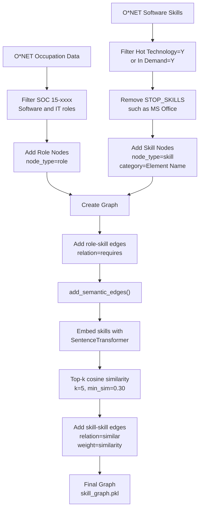
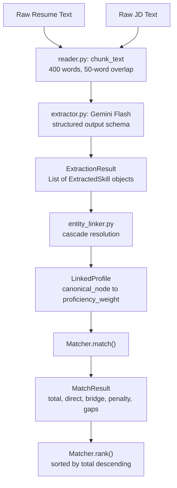

# Synapse Knowledge Graph & Scoring Documentation

**Generated:** 2026-08-15  
**Purpose:** Internal reference — how the graph is built, what it represents, and how scoring works.  
**Git status:** Ignored (see `.gitignore`)

---

## 1. Knowledge Graph Construction

### 1.1 Source Data: O*NET

We use the **O*NET 30.3** taxonomy (US Department of Labor), specifically:

| File | Purpose |
|---|---|
| `Occupation Data.txt` | Role definitions (title, SOC code, description) |
| `Software Skills.txt` | Skill-to-role mappings with metadata |

**Location:** `data/taxonomies/onet/db_30_3_text/` (git-ignored; re-download via `scripts/fetch_onet.sh`)

---

### 1.2 Graph Build Pipeline



---

### 1.3 Graph Structure

#### Nodes

| Node Type | Attributes | Count (approx.) |
|---|---|---:|
| **Role** | `node_type="role"`, `soc="15-xxxx"`, `Title` | ~25 |
| **Skill** | `node_type="skill"`, `category="Element Name"`, `Workplace Example` | ~200 |

#### Edges

| Relation | Direction | Weight | Meaning |
|---|---|---:|---|
| `requires` | Role → Skill | 1.0 (implicit) | Role requires this skill from O*NET |
| `similar` | Skill ↔ Skill | `cosine_sim ∈ [0.30, 1.0]` | Semantic similarity via embeddings |

#### Example Subgraph

```text
Software Developer (role)
    | requires
    v
Docker (skill, category="Development environment software")
    | similar (weight=0.87)
    v
Kubernetes (skill, category="Container orchestration software")
    | similar (weight=0.82)
    v
Amazon Web Services AWS software (skill, category="Cloud platform software")
```

---

### 1.4 Key Build Decisions

| Decision | Rationale |
|---|---|
| **SOC 15-xxxx only** | Focus on software and IT roles; avoids noise from unrelated occupations |
| **Hot Technology OR In Demand** | Keeps market-relevant tools and removes many academic or legacy skills |
| **STOP_SKILLS exclusion** | Generic office tools such as Word and PowerPoint are high-frequency but low-signal |
| **Context-enriched embeddings** | `"Docker (Development environment software)"` is more informative than `"Docker"` alone |
| **Top-k: k=5, min_sim=0.30** | Keeps a sparse graph; each skill links to up to five nearest neighbors above the threshold |
| **Undirected similar edges** | Similarity is symmetric and supports bidirectional bridge discovery |

---

### 1.5 Output Artifact

- **File:** `data/skill_graph.pkl`
- **Format:** NetworkX `Graph` pickle
- **Reload:** `nx.read_gpickle("data/skill_graph.pkl")`

---

## 2. What the Graph Means

### 2.1 Semantic Bridgeability

The `similar` edges encode **skill proximity**: semantic relatedness inferred through embedding similarity, rather than mere co-occurrence.

Example: if a candidate knows `Docker`, the graph may provide:

- `Docker` --0.87--> `Kubernetes`
- `Docker` --0.72--> `Amazon ECS`
- `Docker` --0.45--> `Jenkins`

If a job description requires `Kubernetes` and the candidate has `Docker`, the system can classify Kubernetes as a bridgeable gap because it is one hop away with high similarity.

### 2.2 Distance Metric

For scoring, similarity is converted to distance:

```text
distance = 1 - similarity
```

| Similarity | Distance | Interpretation |
|---:|---:|---|
| 0.90 | 0.10 | Near-identical, such as `K8s` and `Kubernetes` |
| 0.70 | 0.30 | Strongly related, such as `Docker` and `Kubernetes` |
| 0.50 | 0.50 | Moderately related, such as `React` and `Vue.js` |
| 0.30 | 0.70 | Weakly related; graph threshold floor |

### 2.3 Dual View: Weighted Distance and Hop Count

The graph supports two independent path metrics:

```text
Docker --0.87--> Kubernetes --0.82--> AWS

Weighted distance = (1 - 0.87) + (1 - 0.82)
                  = 0.13 + 0.18
                  = 0.31

Hop count = 2
```

- **Weighted distance:** Sum of `1 - similarity` across a path. Used to calculate bridge credit.
- **Hop count:** Number of graph edges in a path. Used to enforce `max_hops` ablations.

---

## 3. Candidate Ranking and Scoring

### 3.1 Pipeline Overview



---

### 3.2 Phase A1: Skill Extraction

**Input:** Plain text from a resume or job description.

**Output:** `ExtractionResult` containing `ExtractedSkill` objects.

```python
@dataclass
class ExtractedSkill:
    skill: str
    weight: float
    context: str
```

Field meanings:

| Field | Meaning |
|---|---|
| `skill` | Free-text skill phrase extracted from the document |
| `weight` | Proficiency or demand value in the range `[0.5, 1.5]` |
| `context` | Supporting sentence from the source document |

Key behaviors:

- Chunking uses approximately 400 words with a 50-word overlap to reduce boundary losses.
- Pydantic validates structured LLM output.
- Invalid extraction output is retried up to three times.
- `merge_skills()` collapses case variants and keeps the highest weight and its associated context.

---

### 3.3 Phase A2: Entity Linking

The linker resolves raw extracted phrases to canonical graph nodes using a deterministic cascade.

```text
Input: "k8s"

1. Alias table
   "k8s" -> "Kubernetes"
   score = 1.0
   method = METHOD_ALIAS

2. Surface index
   Normalized lookup using vendor stripping and acronym-aware matching.
   score = 1.0
   method = METHOD_SURFACE

3. Embedding search
   Select the nearest graph skill if score >= min_score.

4. Unresolved result
   node = None
   method = METHOD_UNRESOLVED
   logged to JSONL for ontology expansion.
```

Example alias mappings:

```text
k8s -> Kubernetes
JS  -> JavaScript
py  -> Python
```

The resulting `LinkedProfile` contains:

- `skills: dict[canonical_node, proficiency_weight]`
- `results: List[LinkResult]`
- `unresolved: List[LinkResult]`

Weights are preserved after canonicalization.

---

### 3.4 Phase A3 and A4: Graph Scoring

#### 3.4.1 Reachability Computation

For candidate canonical skill set \( C = \{s_1, s_2, \ldots\} \), run multi-source Dijkstra over the skill graph.

```python
dist, paths = nx.multi_source_dijkstra(
    skill_graph,
    sources=list(candidate_skills),
    weight="distance",
)

hops, hop_paths = nx.multi_source_dijkstra(
    skill_graph,
    sources=list(candidate_skills),
    weight=None,
)
```

For each job-description skill, this provides:

| Metric | Meaning |
|---|---|
| `distance` | Minimum weighted semantic distance from a candidate skill |
| `hops` | Minimum number of edges from a candidate skill |
| `via` | Candidate skill that supplies the best bridge path |

#### 3.4.2 Gap Classification

For each job-description skill \( j \) with demand weight \( w_j \):

| Condition | Classification | Contribution |
|---|---|---|
| `j in C` | Direct match | `w_j * proficiency_credit(candidate_weight)` |
| Not direct, `distance <= bridge_cutoff`, and `hops <= max_hops` | Bridgeable gap | Bridge credit minus optional bridgeable penalty |
| Otherwise | True gap | Optional unreachable penalty |

```python
def proficiency_credit(candidate_weight: float) -> float:
    if not use_weights:
        return 1.0

    credit = candidate_weight / proficiency_reference
    return clamp(credit, min_proficiency_credit, 1.0)
```

Default behavior:

- `proficiency_reference = 1.0`
- Candidate weight `1.0` receives full credit.
- Candidate weight `0.5` receives half credit.
- Candidate weights above `1.0` are capped at `1.0`.

#### 3.4.3 Final Score Formula

```text
total_demand = sum(w_j) if use_weights else count(JD skills)

direct_match_score =
    sum(w_j * proficiency_credit(candidate_weight))

bridge_score =
    sum(w_j * (1 - distance) * bridge_credit_scale)

gap_penalty =
    sum(w_j * bridgeable_penalty for bridged skills)
    +
    sum(w_j * unreachable_penalty for true gaps)

total =
    (direct_match_score + bridge_score - gap_penalty)
    / total_demand
```

The expected score range is:

```text
[-unreachable_penalty, 1.0]
```

With default zero penalties, normal scores generally fall between `0.0` and `1.0`.

#### 3.4.4 Explainable Match Result

```python
@dataclass
class MatchResult:
    total: float
    direct_match_score: float
    bridge_score: float
    gap_penalty: float
    total_demand: float
    matched_skills: list[str]
    bridged_skills: list[Gap]
    missing_skills: list[Gap]
    name: str
```

Each `Gap` records the job-description skill, bridge source skill, path distance, path hops, and demand weight.

Legacy dictionary-style access remains supported:

```python
result["score"]
result["matched"]
result["gaps"]
```

---

### 3.5 Ranking

```python
ranked = Matcher(graph).rank(
    jd_skills=jd_profile.skills,
    candidates={
        "Aisha": aisha_profile.skills,
        "Ravi": ravi_profile.skills,
    },
    top_k=10,
)
```

Candidates are ordered by total score in descending order.

When scores are equal, names are sorted alphabetically for deterministic output.

---

## 4. Ablation Knobs

All scoring tunables live in `ScoringParams`; no source-code changes are needed for ablation experiments.

| Parameter | Default | B4 Variant | Effect |
|---|---:|---|---|
| `use_weights` | `True` | `False` | Uses uniform demand and proficiency weights |
| `enable_bridging` | `True` | `False` | Enables direct-match-only scoring |
| `max_hops` | `None` | `1` or `2` | Restricts bridge path radius |
| `bridge_cutoff` | `0.6` | Sweep values | Maximum semantic distance accepted as bridgeable |
| `bridgeable_penalty` | `0.0` | Greater than `0.0` | Penalizes partial bridgeable gaps |
| `unreachable_penalty` | `0.0` | Greater than `0.0` | Penalizes true gaps |

---

## 5. Example: DevOps Role Scoring

### Job Description Demand Weights

```text
Kubernetes: 1.5
Docker: 1.5
AWS: 1.5
Terraform: 1.0
Jenkins: 1.0
Python: 1.0
Linux: 1.0
Prometheus: 0.5

Total demand = 9.0
```

### Candidate: Ravi

Canonical skills after entity linking:

```text
Docker: 1.0
Jenkins: 1.0
AWS: 1.0
Python: 1.0
Linux: 1.0
```

### Graph-Based Classification

| JD Skill | Candidate Has It? | Distance | Via | Hops | Classification |
|---|---|---:|---|---:|---|
| Kubernetes | No | 0.13 | Docker | 1 | Bridgeable |
| Docker | Yes | — | — | — | Direct |
| AWS | Yes | — | — | — | Direct |
| Terraform | No | 0.35 | AWS | 2 | Bridgeable |
| Jenkins | Yes | — | — | — | Direct |
| Python | Yes | — | — | — | Direct |
| Linux | Yes | — | — | — | Direct |
| Prometheus | No | 0.65 | Linux | 2 | True gap |

### Score Breakdown

```text
direct_match_score =
    1.5 for Docker
    + 1.5 for AWS
    + 1.0 for Jenkins
    + 1.0 for Python
    + 1.0 for Linux
    = 6.0

bridge_score =
    1.5 * (1 - 0.13)
    + 1.0 * (1 - 0.35)
    = 1.305 + 0.650
    = 1.955

gap_penalty = 0.0
total_demand = 9.0

total = (6.0 + 1.955 - 0.0) / 9.0
      = 0.884
```

Example `MatchResult.explain()` output:

```text
fit=0.884  (direct 6.00 + bridge 1.96 - penalty 0.00) / demand 9.00
  matched   : AWS, Docker, Jenkins, Linux, Python
  bridged   : Kubernetes <- Docker (d=0.13, 1 hop)
              Terraform <- AWS (d=0.35, 2 hops)
  missing   : Prometheus
```

---

## 6. Files Reference

| File | Purpose |
|---|---|
| `src/synapse/graph/build_graph.py` | Builds the graph from O*NET data |
| `src/synapse/matching/aliases.py` | Normalization, alias table, and surface index |
| `src/synapse/matching/entity_linker.py` | Cascade linking and weight preservation |
| `src/synapse/matching/matcher.py` | Scoring, reachability, and ranking |
| `src/synapse/ingest/reader.py` | Document reading and chunking |
| `src/synapse/ingest/extractor.py` | LLM extraction with schema validation |
| `src/synapse/ingest/schemas.py` | Pydantic schemas |
| `data/skill_graph.pkl` | Serialized NetworkX graph; git-ignored |
| `tests/test_*.py` | Unit test suite; 56 tests passing |

---

## 7. Phase C Migration Notes

| Component | Current | Phase C Target |
|---|---|---|
| Embedder | `sentence-transformers` using PyTorch | `fastembed` using ONNX on CPU |
| Graph storage | NetworkX with pickle serialization | Neo4j AuraDB Free |
| Linker threshold | `DEFAULT_MIN_SCORE = 0.60` | Calibrated by `scripts/calibrate_link_threshold.py` |
| Dynamic `MERGE` | Not implemented | Guarded by canonicalization and threshold validation |

---

*End of document.*